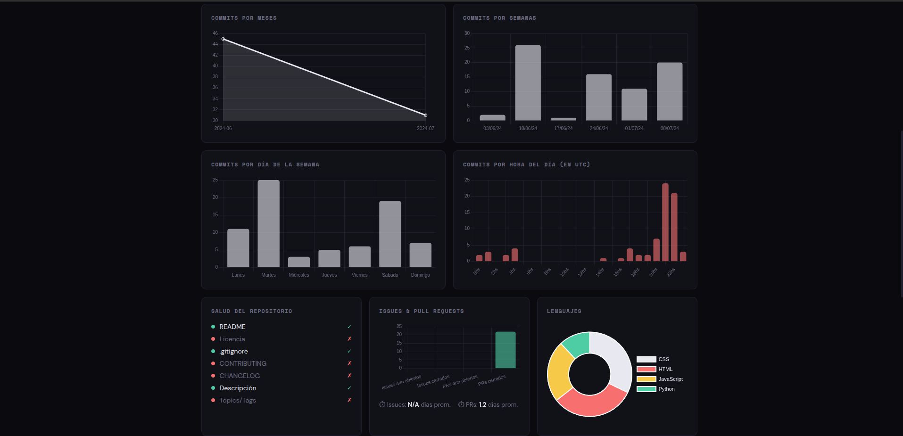
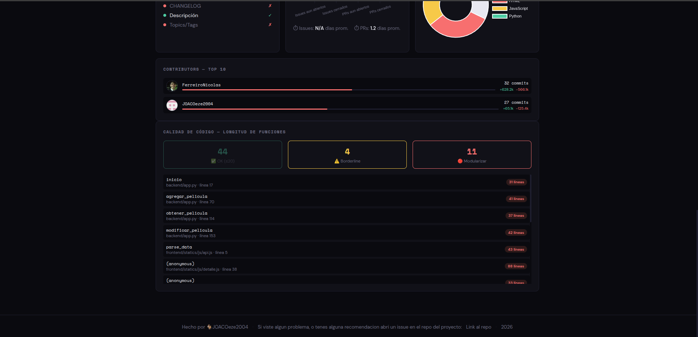
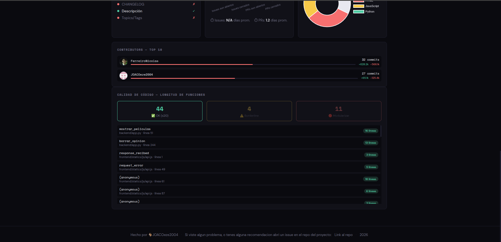

# {} Analizador de Repositorios
 
Una herramienta web para analizar repositorios públicos de GitHub y obtener métricas detalladas de actividad, calidad de código, contributors y salud del proyecto — todo en un dashboard visual.
 
**[Link a la página](https://analizador-de-repositorios.netlify.app/)**

## ¿Por qué lo hice?

## Qué aprendí

Este proyecto fue una excusa para aplicar y profundizar varios conceptos que o no sabia o que estaban verdes:

- **Consumo de APIs externas** — trabajé con la API de GitHub a través de PyGithub, manejando rate limits y gestión de tokens de github.
- **Análisis estático de código** — usé `lizard` para analizar la longitud de funciones en 12 lenguajes distintos sin ejecutar el código. Util para saber que funciones hay que modularizar.
- **Caché con SQLAlchemy** — los análisis se guardan en base de datos y se reutilizan si tienen menos de 6 horas, evitando requests innecesarias a GitHub.
- **Diseño de un sistema de scoring** — diseñé un score del 0 al 100 con criterios ponderados (salud, calidad de código, colaboración, issues/PRs).
- **Concurrencia con `ThreadPoolExecutor`** — Si bien, usamos concurrencia para otro proyecto con C++, la realidad es que teníamos un problema de performance, que afectaba al tiempo para responder al usuario con el analisis una vez pasado el repo, viendo que las llamadas a la API de GitHub son independientes entre sí (actividad, contributors, issues, salud del repo, análisis de código), puede hacer que se ejecuten de forma paralela para reducir el tiempo de respuesta de ~60s a ~10s en promedio (aunque dependemos del server de railway y de su latencia).
- **Deploy de la pagina** — Anteriormente, hice algún proyecto con páginas web, pero este es el primero que hago un deploy. 

---

## Funcionalidades
- **Score general** — puntaje del 0 al 100 basado en salud, calidad de código, colaboración e issues/PRs.
- **Actividad** — gráficos con commits por mes, semana, día de la semana y hora del día, y algunas estadísticas más generales como cantidad total de commits, tamaño del repo, promedio de commits por semana y mes, si tiene prs o issues abiertos, la fecha del primer y último commit, el tiempo de actividad y desde hace cuantos días no hay actividad.
- **Contributors** — top 10 con avatar, commits, líneas agregadas/eliminadas y % de ownership
- **Issues & Pull Requests** — cantidad abiertos/cerrados y tiempo promedio de cierre/merge
- **Salud del repositorio** — presencia de README, licencia, .gitignore, CONTRIBUTING, CHANGELOG, descripción y topics
- **Calidad de código** — análisis de la longitud de las funciones en Python, JavaScript, TypeScript, Java, C, C++, C#, Rust, Go, Ruby, Swift y Kotlin. Dividiendola en 3 grupos:
    - **Ok**: Si tiene menos de 20 líneas la función, marcando que esta bien.
    - **Warning** Si tiene más de 20 líneas pero menos de 30, marcando que está ahí de una modularización.
    - **Crítico** si tiene más de 30 líneas, marcando que si o si necesita una modularización.
- **Caché** — los análisis se guardan y reutilizan por 6 horas
 
---

## Tecnologías
 
**Backend**
- Python + Flask 
- PyGithub (para request a las stast del repo)
- SQLAlchemy
- lizard (análisis estático)
 
**Frontend**
- HTML / CSS / JavaScript
- Chart.js
 
**Deploy**
- Railway (backend)
- Netlify (frontend)

## Correrlo localmente

--- 

## Screenshots

---

## Limitaciones conocidas
 
- Solo funciona con repositorios **públicos**.
- El análisis se limita a **5000 commits** y **50 contributors** por performance.
- El análisis de funciones soporta los 12 lenguajes mencionados anteriormente — otros lenguajes muestran N/A en esa sección.
